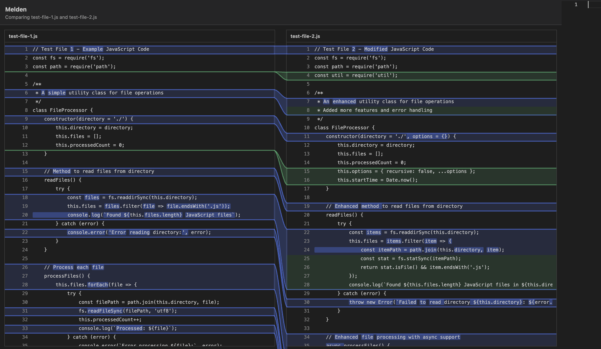

# Melden

Melden is a VS Code extension for side-by-side comparison with a custom Meld-style diff view.



## Features

- Editable two-way side-by-side diff view
- Meld-style connectors, block contours, and inline change highlighting
- Git file history viewer with commit-by-commit navigation
- Experimental three-way merge visualization

## Status

This project is usable as a local or private pre-release VS Code extension. The two-way diff and git history flows are the most complete. Three-way merge is still experimental and should not be treated as an apply-safe merge tool.

## Install For Development

Install dependencies and compile:

```bash
npm install
npm run compile
```

Run the extension in VS Code:

1. Open this folder in VS Code.
2. Press `F5`.
3. In the Extension Development Host, run one of the Melden commands from the Command Palette.

## Package For External Use

This repo is set up for local/private packaging. A typical release flow is:

```bash
npm install
npm test
npx @vscode/vsce package
```

That produces a `.vsix` you can install with `Extensions: Install from VSIX...`.

## Commands

- `Melden: Compare Files`
- `Melden: Compare with Selected`
- `Melden: Three Way Merge (Experimental)`
- `Melden: Compare Test Files`
- `Melden: Compare File History`
- `Melden: Compare Active File History`

## Limitations

- Three-way merge is not a full `diff3` implementation.
- Merge results are visualized only; they are not written back to disk.
- The git history viewer currently steps through single-parent commit history for one file at a time.
- Marketplace publishing metadata is not finalized yet.

## Release Work

The current release checklist and remaining publication blockers are tracked in [RELEASE_PLAN.md](./RELEASE_PLAN.md).

## Codebase Guide

Architecture and implementation details are documented in [CODEBASE.md](./CODEBASE.md).

## Tests

Run the current unit checks with:

```bash
npm test
```
