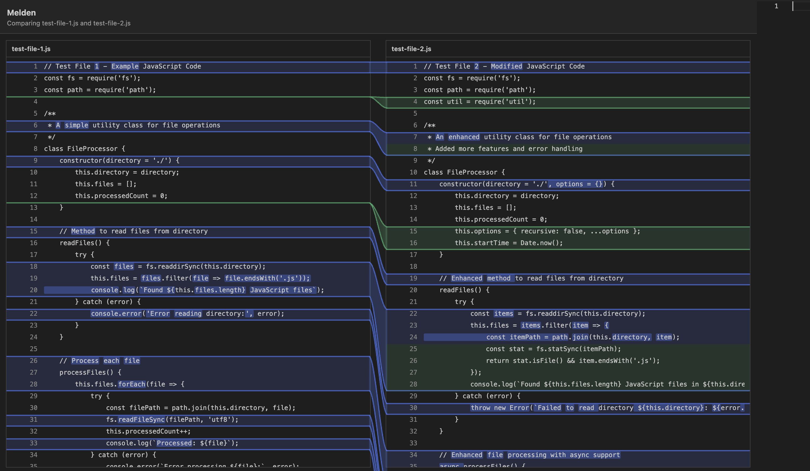

# Bygone

Bygone is a VS Code extension and standalone desktop app for visual diff and file history.



## Features

- Editable two-way side-by-side diff view
- Dynamic adjacent multi-panel diff view
- Flowing connectors, block contours, and inline change highlighting
- Git file history viewer with commit-by-commit navigation
- Local branch-change exploration using merge-base-to-tip semantics and changed-file progress
- Binary-aware comparisons with side-by-side image previews and byte-equality reporting

## Status

This project is usable as a VS Code extension and standalone desktop app. The two-way diff and git history flows are the most complete. The multi-panel view is diff-focused, not a merge tool.

## Install For Development

Install dependencies and compile:

```bash
npm install
npm run compile
```

Run the extension in VS Code:

1. Open this folder in VS Code.
2. Press `F5`.
3. In the Extension Development Host, run one of the Bygone commands from the Command Palette.

Run the standalone desktop app locally:

```bash
npm run standalone:start
```

Run a headless standalone smoke check:

```bash
npm run standalone:smoke
```

For development only, you can install the repo-local launcher globally:

```bash
npm install -g .
bygone
bygone path/to/file-or-directory
bygone --diff path/to/left path/to/right
bygone --diff
bygone --diff path/to/file1 path/to/file2 path/to/file3 [...]
bygone --history path/to/path
bygone review
bygone review feature/my-branch --base origin/main
bygone present feature/my-branch --base origin/main
bygone completion zsh
bygone --help
```

For a one-command local sync that builds the repo, installs the global CLI, packages the desktop app, and auto-installs the VSIX and desktop app for your current platform:

```bash
npm run dev:sync
```

CLI defaults:
- In a Git repo, `bygone` opens directory history for the current directory.
- Outside a Git repo, `bygone` opens a blank editable diff.
- `bygone <file>` opens file history.
- `bygone <directory>` opens Git directory history for that directory.
- `bygone --history <path>` opens file or directory history.
- `bygone review [<head>] [--base <base>]` reviews the committed branch tip against its merge base. The base is detected from `origin/HEAD`, `main`, or `master` when omitted.
- `bygone present [<head>] [--base <base>]` opens the same committed range as an app-hosted change tour, grouped into a deterministic suggested reading order.
- `bygone <left> <right>` auto-selects file diff or directory compare.
- `bygone --diff <file1> <file2> <file3> ...` opens multi-panel diff or multi-directory compare.

On macOS, desktop-backed CLI commands and change tours route into the running
Bygone app instead of opening another app instance and Dock item. Starting a
new comparison brings the central app window forward and replaces its current
session after any unsaved-change confirmation. Tours reuse a dedicated window
owned by that same app process.

Shell completion is generated from the same command specification as `bygone --help`, including contextual file arguments and local Git refs for branch review. `npm run dev:sync`, the desktop app's command-line installer, and the Homebrew packages install completions automatically. To install one manually, choose the command for your shell:

```bash
mkdir -p ~/.zfunc ~/.local/share/bash-completion/completions ~/.config/fish/completions
bygone completion zsh > ~/.zfunc/_bygone # add ~/.zfunc to fpath before compinit
bygone completion bash > ~/.local/share/bash-completion/completions/bygone
bygone completion fish > ~/.config/fish/completions/bygone.fish
```

If the native desktop app is installed, the npm/source launcher prefers it and forwards the shell working directory. Set `BYGONE_FORCE_BUNDLED=1` to force the npm-bundled Electron runtime instead. The launcher removes `ELECTRON_RUN_AS_NODE` before starting Electron so editor-integrated terminals cannot accidentally force the app into Node mode.

Branch review compares the selected head directly with `merge-base(base, head)`, so merge commits are represented correctly in the aggregate diff. Commit metadata retains every parent of merge commits for future temporal review. Dirty index and working-tree changes are reported but never silently included. Detected renames keep distinct old and new paths for correct drill-down and navigation without adding persistent cross-tree connectors.

Two-file and directory drill-down comparisons detect binary content before decoding it as text. Images render side by side when they are small enough to preview inline; all binary comparisons report whether the underlying bytes are identical.

Change tours can layer an authored, code-connected narrative over the complete generated change set. Pass a `.bygone` file with `--tour`; named source anchors compile to exact commit and line references, while an independent Files rail keeps every changed file available without adding filler scenes to the narrative. The legacy `.bygone.yaml` spelling remains supported. Try the self-referencing example with `bygone present --tour examples/bygone-history.bygone`, then see the [change tour format](./docs/change-tour-format.md).

Packaged macOS builds register `.bygone` with the desktop app, so Finder can open a presentation directly. Windows and Linux builds currently require opening the file through Bygone or the `bygone` command; they do not install an operating-system file association.

Agents can validate anchors and structure with `bygone tour validate <file.bygone> --json`, compile a portable manifest with `bygone tour compile`, and retrieve the authoring contract with `bygone tour schema`. See [Generating change tours with an LLM](./docs/generating-change-tours.md), or give a compatible agent the repository's vendor-neutral [`pr-tour-guide` skill](./skills/pr-tour-guide/SKILL.md).

Contributors should consult the internal [product surface overview](./docs/product-surface.md) before adding a command, mode, tour scene, or packaged artifact.

`bygone tour context [<head>] --base <base>` produces a provider-neutral change dossier with bounded patches, changed ranges, file roles, symbol hints, commits, renames, and explicit binary omissions for an LLM to consume.

The desktop app also includes `Help -> Install Command Line Tools...` for non-npm installs. Homebrew cask installs can provide the `bygone` command automatically.

## Package For External Use

This repo is set up for local/private packaging. A typical release flow is:

```bash
npm install
npm test
npx @vscode/vsce package
```

That produces a `.vsix` you can install with `Extensions: Install from VSIX...`.

Build the standalone desktop packages:

```bash
npm install
npm run package:desktop
```

That produces a macOS DMG in `dist/`. Cross-target packaging is split out because Windows and Linux builds may need additional Electron downloads or Wine support:

```bash
npm run package:desktop:mac:zip
npm run package:desktop:linux
npm run package:desktop:win
npm run package:desktop:all
```

Stage the scoped npm standalone package:

```bash
npm install
npm run package:npm
npm pack --dry-run ./dist/npm-package
```

The root `package.json` is the VS Code extension manifest and intentionally keeps the unscoped extension name `bygone`. The npm distribution is staged separately as `@davmash/bygone` so the global launcher can avoid the already-taken `bygone` package name while preserving the VS Code extension id `davidmashburn.bygone`.

Homebrew packaging templates live in `packaging/homebrew/`. They are staged for local validation only until release artifact URLs and checksums exist.

Build the full local release artifact matrix:

```bash
npm run release:build
```

That runs tests, rebuilds the VSIX, stages and dry-run checks the npm package, builds desktop artifacts, and styles the Homebrew templates. If the local macOS DMG or Windows cross-build toolchain is unavailable, use `node ./scripts/release.mjs --skip-dmg` or `node ./scripts/release.mjs --skip-windows` while validating the rest of the matrix.

Publishing is intentionally explicit:

```bash
npm run release:publish
```

`release:publish` publishes the npm package, creates a GitHub release for desktop artifacts, and updates a Homebrew tap. Set `BYGONE_HOMEBREW_TAP` to a local tap checkout before publishing Homebrew formulas. Until Marketplace trusted-publisher policies are publicly configurable, upload the packaged VSIX from the Visual Studio Marketplace publisher page.

Run the release checks:

```bash
npm run release:check
npm run standalone:smoke
```

The standalone smoke check is intentionally run directly because Electron can abort on macOS when launched from a longer nested npm command chain, while the same smoke check passes as a direct release gate.

In the standalone window, you can also drag and drop:

- 1 file to open git history for that file
- 2 files or directories to open a side-by-side compare
- 3 or more files to open a multi-panel compare
- 3 directories to open a three-directory compare

## Git Difftool

Bygone can be launched from `git difftool` through either the standalone app or the VS Code extension.

Configure the standalone launcher:

```bash
./scripts/configure-git-difftool-standalone.sh
```

That registers:

```text
git difftool -t bygone
```

Configure the VS Code launcher:

```bash
./scripts/configure-git-difftool.sh
```

That registers:

```text
git difftool -t bygone-vscode
```

The VS Code path launches:

```text
vscode://davidmashburn.bygone/diff?left=...&right=...
```

The wrapper scripts are:

```bash
./scripts/bygone-difftool.sh <left-file> <right-file>
./scripts/bygone-standalone-difftool.sh <left-file> <right-file>
```

## Commands

- `Bygone: Compare Active File With…`
- `Bygone: Compare Selected Files`
- `Bygone: Compare with Selected`
- `Bygone: Cancel Staged Comparison`
- `Bygone: View Active File History`
- `Bygone: Open This Comparison in Desktop`
- `Bygone: Compare Directories in Desktop…`
- `Bygone: Compare Three or More Files in Desktop…`
- `Bygone: Explore Current Branch in Desktop`
- `Bygone: Present Current Branch in Desktop`
- `Bygone: Open Authored Tour in Desktop…`
- `Bygone: Install or Open Desktop App`

Two-file comparisons open as independent editor tabs. Trusted local worktree
panes edit through VS Code documents, so changes participate in dirty state,
undo, save, and external-document updates. Historical and non-local inputs are
read-only. Desktop hand-offs are unavailable in remote extension hosts.

## Limitations

- Bygone is intentionally diff-focused; merge tooling is not exposed as a product feature.
- Directory compare supports modified-file detection and file drill-down; deep tree ergonomics are still early.
- The git history viewer currently steps through single-parent commit history for one file at a time.

## Release Work

The current release checklist and remaining publication blockers are tracked in [RELEASE_PLAN.md](./RELEASE_PLAN.md).

## Codebase Guide

Architecture and implementation details are documented in [CODEBASE.md](./CODEBASE.md).

## Walkthrough

A screenshot-based walkthrough using Bygone on its own source tree lives in [docs/walkthrough.md](./docs/walkthrough.md).

## Why “Bygone”?

**In short: this project is openly inspired by Meld, and Bygone is meant to carry that visual tradition into a more history-aware tool.**

Meld was a direct inspiration for this project. Its visual diff metaphor is still one of the clearest and most human ways to understand change, and Bygone builds on that lineage while pushing further into revision history.

The name also nods to the bygone era before vibe-coding, when people were at least pretending to read, understand, and take responsibility for the code they were writing. This tool is about looking directly at what changed, where it came from, and how the current state emerged.

And yes, Codex, the irony is noted. Thanks for the assist.

## Tests

Run the current unit checks with:

```bash
npm test
```
