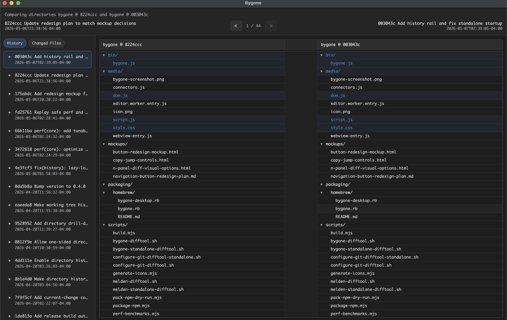
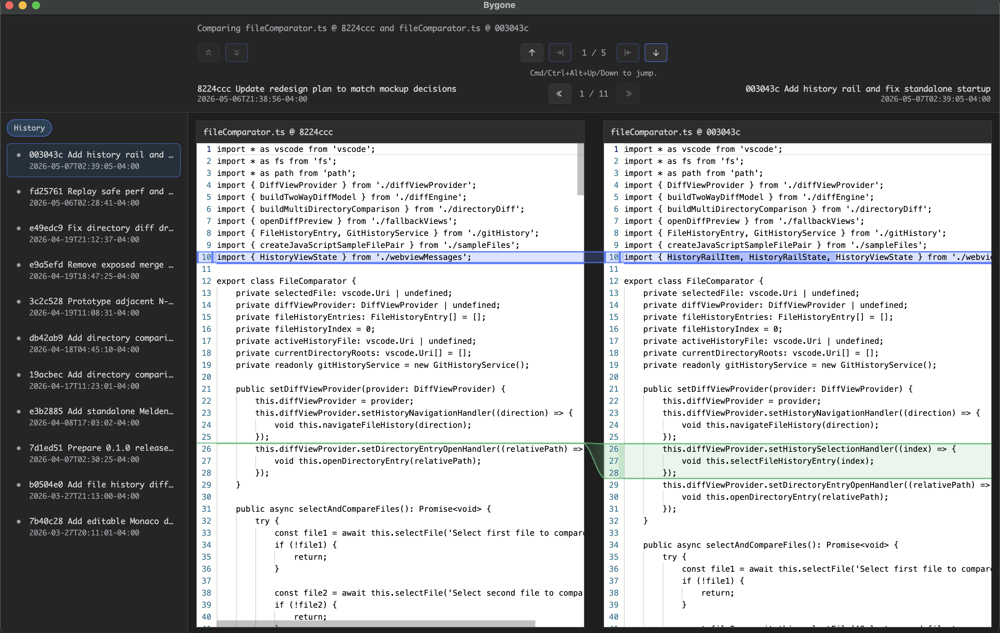
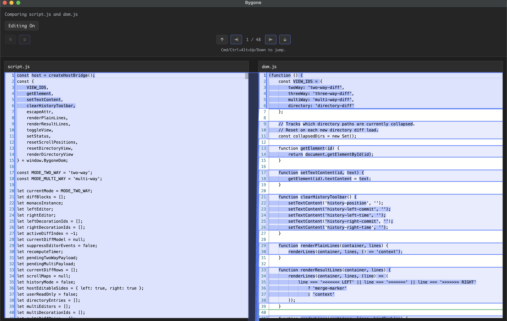

# Bygone Walkthrough

This walkthrough uses Bygone on the Bygone source tree itself, so every screenshot shows real project data rather than sample filler.

Source files used below:

- `src/fileComparator.ts`
- `media/script.js`
- `media/dom.js`
- the repository root for Git directory history

## 1. Start In Directory History

If you launch Bygone with no arguments from the repo root, it opens Git directory history for the current directory:

```bash
cd ~/code/bygone
./bin/bygone.js
```

You can also be explicit:

```bash
./bin/bygone.js --dir-history ~/code/bygone
```



What to look for:

- The timeline controls at the top move commit-by-commit.
- The left rail defaults to `History`, with `Changed Files` available as a secondary scope.
- The main panes compare directory snapshots, not individual files.
- This is the best starting point when you want to answer “what changed in this repo over time?”

## 2. Narrow Down To One File

For a file-level history view, point Bygone at a single tracked file:

```bash
./bin/bygone.js --history ~/code/bygone/src/fileComparator.ts
```



What to look for:

- The history rail stays visible and becomes the primary way to jump between commits for that file.
- Commit labels stay pinned above the two panes, so it is always clear which revision is on each side.
- Change navigation sits above the editors. `Cmd/Ctrl+Alt+Up` and `Cmd/Ctrl+Alt+Down` jump between diff hunks.
- This view is useful when you already know the file and want to understand how a specific implementation evolved.

## 3. Open A Direct Two-File Diff

For a plain compare outside Git history, pass two files:

```bash
./bin/bygone.js ~/code/bygone/media/script.js ~/code/bygone/media/dom.js
```



What to look for:

- There is no history rail here because this is a direct file-to-file compare, not a history session.
- The compare stays focused on the diff canvas: current change position, copy controls, and hunk traversal.
- `Editing On` indicates that both panes are editable in this mode.
- This is the fastest path when you want to compare two working files directly, regardless of Git history.

## 4. Recommended Mental Model

The current UI makes the most sense if you think about it along two axes:

- `file` vs `directory`
- `git-backed history` vs `direct compare`

That yields the core flows:

- directory history
- file history
- directory diff
- file diff

The shell then stays mostly consistent:

- context at the top
- commit navigation only in history-backed views
- history or changed-files navigation in the left rail when it adds value
- change navigation and copy actions close to the diff panes

## 5. Practical Shortcuts

- `bygone` or `bygone <directory>`: open Git directory history
- `bygone <file>`: open file history
- `bygone <left> <right>`: open a direct file or directory compare
- `Cmd/Ctrl+Alt+Down`: next change
- `Cmd/Ctrl+Alt+Up`: previous change

## 6. When To Use Which View

- Start in directory history when the question is “what happened in this area of the repo?”
- Switch to file history when the question becomes “how did this file get here?”
- Use direct file diff when you already have two concrete files and just want the compare.
